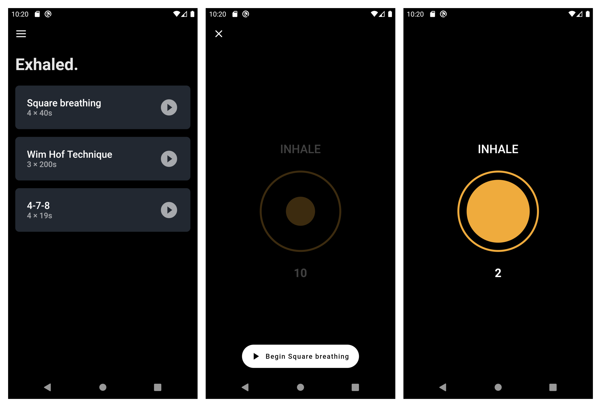

# Exhaled: Breathing Techniques

Exhaled is minimalist app to help you practice breathing techniques.



## Technical details

- [BLoC](https://pub.dev/packages/flutter_bloc) for state management.
- [freezed](https://pub.dev/packages/freezed) for sealed unions. 
- [get_it](https://pub.dev/packages/get_it) for dependency injection of services.
- [injectable](https://pub.dev/packages/injectable) for auto-registering services with `get_it`.

## Build

Run `build_runner` to generated code.

```
flutter packages pub run build_runner watch
```